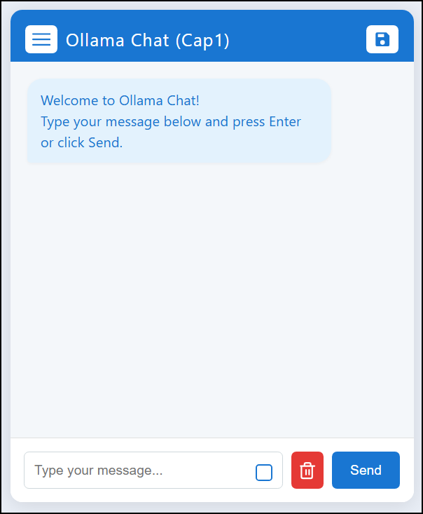
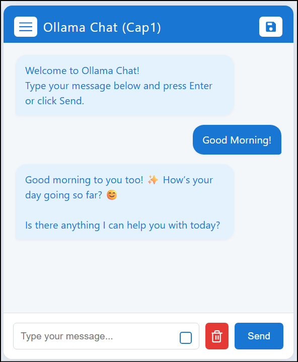
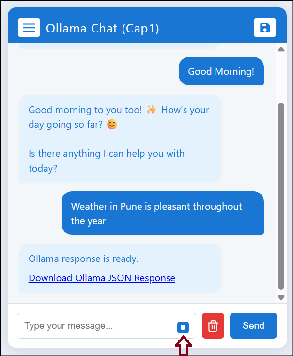
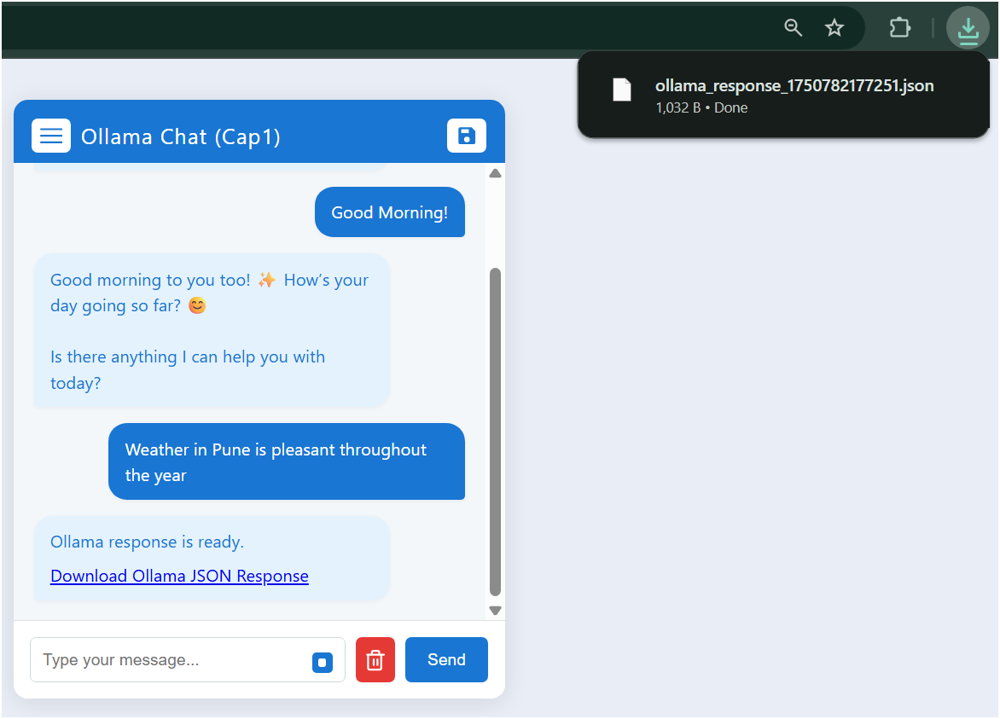
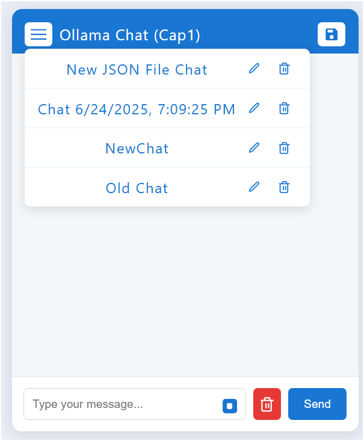
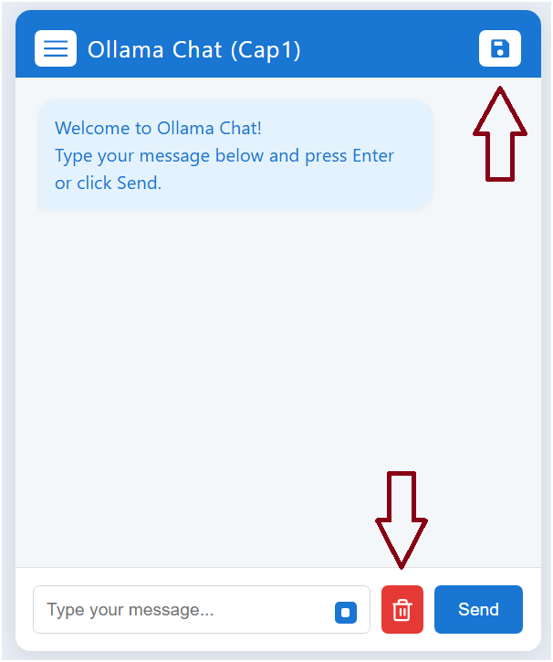

# Ollama Chat Demo

A Spring Boot application providing a web-based chat interface powered by Ollama.  
This app allows users to interact with an AI model, receive responses as text or downloadable JSON files, and manage chat history.

## Features

- **Chat with Ollama AI**: Type messages and receive AI-generated responses in real time.
- **Download JSON Response**: Optionally receive Ollama's response as a downloadable JSON file.
- **Chat History**: Save, load, rename, and delete previous chat sessions.
- **Clear Chat**: Quickly clear the current chat window.
- **Elegant UI**: Modern, responsive chat interface with tooltips and icons.

---

## UI Screenshots

### 1. Main Chat Window



---

### 2. Sending a Message

Type your message and press **Send** or hit **Enter**.



---

### 3. Receive JSON File as Response

Check the box inside the input field to receive the response as a downloadable JSON file.



When checked, the AI response appears as a download link:



---

### 4. Chat History Management

- **View**: Click the menu icon to see saved chats.
- **Rename**: Edit chat names.
- **Delete**: Remove unwanted chats.



---

### 5. Save and Clear Chat

- **Save**: Click the floppy disk icon to save the current chat.
- **Clear**: Use the trash icon to clear the chat window.



---

## Getting Started

### Prerequisites

- Java 17+
- Maven

### Build and Run

```bash
mvn clean package
java -jar target/chatbot-using-AIML-0.0.1-SNAPSHOT.jar